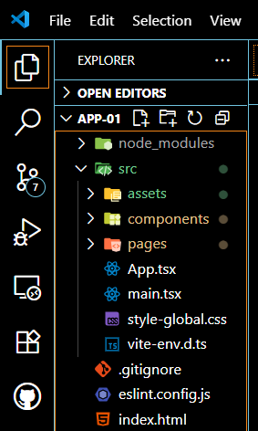

  <h2>Card de Perfil - Aula 01</h2>
  

---

Nessa primeira aula exploramos o conceito de componetização do React com o desenvolvimento de uma página de apresentação simples: 

  

---

### A componentização em React é importante porque:

- Organiza o código: quebra a interface em partes menores e reutilizáveis, facilitando manutenção e leitura.

- Reaproveita funcionalidades: evita repetição, permitindo usar o mesmo componente em vários lugares.

- Facilita testes: cada parte pode ser testada de forma isolada.

- Melhora escalabilidade: torna mais simples adicionar e modificar recursos conforme o projeto cresce.

- Aumenta consistência visual e lógica: mantém o mesmo comportamento e estilo em diferentes partes da aplicação.

      Em resumo: componentizar é como montar um LEGO — cada peça é independente, mas juntas formam algo maior e mais fácil de gerenciar.
      
---

# Estruturação de pastas

  
  

    
 
    Uma boa estruturação de pastas ajuda a organizar o projeto, melhora a manutenção, facilita colaboração.
      

      
 
   Basicamente uma boa estrutura de pastas é como ter um armário arrumado — você encontra o que precisa rápido e evita o caos.
  

   
 
  Podemos encontrar diversas estruturação de diretórios e cada um segue uma lógica diferente.
  

  

---
by : Adrian Pereira - [LinkedIn](https://www.linkedin.com/in/dev-adrian-pereira/) - [GitHub](https://github.com/adrianPers)